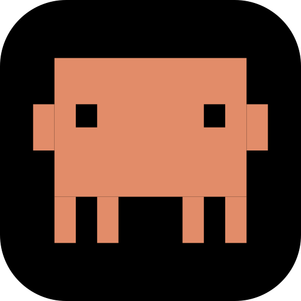

<p align="center">
  
</p>

# Notchy

A tiny, native macOS status indicator for [Claude Code](https://docs.claude.com/en/docs/claude-code) and Codex — sits next to your camera in the notch, turns 🟢 / 🟡 / ⚪ as the agent works / waits / idles, and unfolds on hover to show live 5h and weekly usage. When both agents are configured, collapsed mode shows whichever agent updated most recently.

Built as a lightweight alternative to heavier "Dynamic Island for Claude" tools. Single Swift binary, no Electron, no Python, no background watchers spinning at 60 Hz.

### [⬇️ Download Notchy.pkg (v1.1.0)](https://github.com/Rorogogogo/Notchy/releases/latest/download/Notchy.pkg)

## Why this exists

A passive, glance-and-go indicator. No clickable widgets, no chat history, no background animations spinning at 60 Hz — just a tiny pill that tells you whether the agent is working, waiting on you, or idle, plus a hover-expansion with the actual quota numbers `/usage` would show.

Measured on an M-series MacBook Pro:

- **~0.1 % idle CPU** — between events, only a 250 ms `stat()` poll and a 1 s tick timer
- **~32 MB RSS** — single native binary, no framework runtime overhead
- **~220 KB binary** — compact Swift, links against the system AppKit / SwiftUI
- **Event-driven** via `kqueue` (`DispatchSource.makeFileSystemObjectSource`), not per-frame redraws

## What it shows

- A small black notch-shaped pill, slightly wider than the physical notch
- 🦀 Coral Claude-style crab on the left
- A colored status dot on the right:
  - 🟢 **green** — working (you sent a prompt, agent is generating or running a tool)
  - 🟡 **yellow** — waiting on you (permission prompt or other input)
  - ⚪ **gray** — idle (last turn finished cleanly)
- Hover the pill to expand Dynamic-Island-style and reveal:
  - **5h block** usage with a 16-segment bar and reset countdown
  - **This week** usage with a 16-segment bar and reset countdown
  - Current project + status, with a one-click quit button
- Hides itself completely after 10 minutes of no activity, reappears the instant any configured Claude Code or Codex agent hook fires.

## Live Usage Data

The 5h-block and weekly percentages are **the same numbers** Claude Code's built-in `/usage` shows — including the precise reset times. Notchy doesn't estimate, it doesn't poll Anthropic, it doesn't need an admin API key.

It works by tapping the JSON Claude Code already pipes to your **statusline command** on every TUI render. That JSON contains:

```json
"rate_limits": {
  "five_hour":  { "used_percentage": 52, "resets_at": 1778767200 },
  "seven_day":  { "used_percentage": 33, "resets_at": 1779087600 }
}
```

Notchy's installer adds a 10-line writer block to your `~/.claude/statusline-command.sh` (or creates a minimal one if you have none) that extracts those fields into `~/.claude/state/usage`. The app file-watches that path with `kqueue` and re-renders the bars when it changes. Zero polling, zero network calls.

Numbers refresh on every statusline render (i.e. while a TUI is active). When no TUI is open, the last known numbers stay on screen until the next render.

For Codex, Notchy reads the latest local session `token_count` event that includes `rate_limits`, then writes the same usage format to `~/.codex/notchy/usage`. This gives the Codex row its own 5h and weekly usage bars without network calls.

## Requirements

- macOS 14 (Sonoma) or later
- A MacBook with a notch (M-series 14"/16" Pro, M3 Air, etc.)
- Claude Code and/or Codex installed
- `jq` on `PATH` (preinstalled on most dev machines; `brew install jq` if missing)
- For building from source: Xcode Command Line Tools (`xcode-select --install`)

## Install (from the .pkg)

1. Download `Notchy.pkg` from the [Releases](https://github.com/Rorogogogo/Notchy/releases) page.
2. Double-click. macOS will show "Notchy.pkg cannot be opened because it is from an unidentified developer."
3. Open **System Settings → Privacy & Security**, scroll to the message about Notchy, click **Open Anyway**.
4. Walk through the macOS Installer.
5. **Restart any running Claude Code and/or Codex CLI sessions.** Hooks and the statusline command only load at session start.

> The package is ad-hoc signed (free) but not notarized (requires a paid Apple Developer account). That's why you need the one-time "Open Anyway" step.

The installer's postinstall script will:

- Copy the app to `/Applications/Notchy.app`
- Install scripts to `~/.claude/notchy/` (`play.sh` for status hooks, `statusline.sh` for live usage)
- Install Codex scripts to `~/.codex/notchy/` (`play.sh` for status hooks, `usage.sh` for live usage)
- Merge Claude Code hook entries into `~/.claude/settings.json` (existing hooks preserved)
- Enable Codex lifecycle hooks in `~/.codex/config.toml`
- Merge Notchy Codex hook entries into `~/.codex/hooks.json`
- Append a marked writer block to your existing `~/.claude/statusline-command.sh`, or register a minimal one if you don't have a statusline configured
- Write a LaunchAgent at `~/Library/LaunchAgents/com.notchy.app.plist`
- Start the app immediately and on every login
- Clean up any artifacts from the legacy `ClaudeStatus` build

Re-running the installer is safe — hooks and writer blocks are detected by marker comments and replaced, not duplicated.

## Build from source

```bash
git clone https://github.com/Rorogogogo/Notchy.git
cd Notchy
./build.sh
```

Outputs:
- `build/pkg-root/Applications/Notchy.app` — the standalone app
- `build/Notchy.pkg` — the installer

## How it works

Six pieces:

1. **`play.sh`** — invoked by Claude Code hook events. Reads the hook payload from stdin, writes `<status>\t<unix_ts>\t<project_name>\n` to `~/.claude/state/status`. ~20 ms per invocation.

2. **Statusline writer** — a 10-line block injected into your `~/.claude/statusline-command.sh`. Each statusline render, it pulls `rate_limits` from the JSON Claude Code piped to stdin and writes `<block_pct>\t<block_reset>\t<weekly_pct>\t<weekly_reset>\n` to `~/.claude/state/usage`. Runs in `&` background so your statusline render isn't blocked.

3. **`~/.claude/state/{status,usage}`** — two single-line text files for Claude Code status and usage.

4. **`~/.codex/notchy/play.sh`** — invoked by Codex lifecycle hooks. Reads the hook payload from stdin and writes Codex status updates to `~/.codex/notchy/status`.

5. **`~/.codex/notchy/usage.sh`** — scans recent Codex session JSONL files for the latest `token_count.rate_limits` event and writes `<block_pct>\t<block_reset>\t<weekly_pct>\t<weekly_reset>\n` to `~/.codex/notchy/usage`.

6. **`Notchy.app`** — a long-running native macOS app:
   - Floating `NSPanel` over the physical notch, level above the menu bar
   - Notch-shaped pill drawn with a custom `Shape` (top corners 6pt inward, bottom 14pt outward when collapsed, 22pt when expanded — same curves as the iPhone Dynamic Island)
   - File-watches Claude Code status/usage and Codex status/usage with `DispatchSource.makeFileSystemObjectSource` (kqueue under the hood). Re-renders only when the kernel fires `VNODE_WRITE`.
   - Hover detection constrained to the visible pill shape via `.contentShape(NotchShape(...))`, so transparent areas around the pill don't block clicks to apps below.
   - Spring-animated expansion: ~0.32 s response, 0.78 damping.
   - Auto-expires `waiting` → `idle` after 3 s (see [Caveats](#caveats)).

## Hooks installed

| Claude Code event | Sets status to |
|---|---|
| `SessionStart` | working |
| `UserPromptSubmit` | working |
| `PreToolUse` | working |
| `PostToolUse` | working |
| `PostToolUseFailure` | working |
| `Stop` | idle |
| `StopFailure` | idle |
| `Notification` | waiting |
| `PermissionRequest` | waiting |

## Caveats

- **No hook fires when the user denies a permission prompt** ([per the docs](https://docs.claude.com/en/docs/claude-code/hooks)). Notchy handles this by auto-expiring `waiting` → `idle` after 3 seconds with no further events.
- **Live usage only refreshes while a TUI is active.** Anthropic only sends `rate_limits` in the statusline JSON during an interactive session. When no `claude` TUI is open, the bars freeze at the last known values until the next render.
- **Codex usage refreshes from local session logs.** The Codex bars update after Codex emits a `token_count` event with `rate_limits`; before that, the row shows the last known values.
- **`rate_limits` only appears after the first API response** in a session. Open a fresh TUI without sending anything, and the bars stay on whatever the previous render left.
- **Hooks load at session start.** After installing (or reconfiguring), restart any running Claude Code session.
- **Codex hooks require a restart.** Restart any running Codex CLI session after installing or reconfiguring Notchy.
- **Codex prompts you to trust each hook the first time it runs.** Codex stores a `trusted_hash` per hook in `~/.codex/config.toml` and asks for approval the first time it sees a new (or changed) hook command. You'll see one prompt per lifecycle event (`SessionStart`, `UserPromptSubmit`, `PreToolUse`, `PostToolUse`, `Stop`, `Notification`, `PermissionRequest`, etc.) — approve to let Notchy receive status updates. Codex's hook review UI numbers hooks by order (`Hook 1`, `Hook 2`, etc.); Notchy adds `statusMessage` labels to its hook commands, but Codex still controls the row title. Re-running the installer with updated hook metadata will re-prompt because the hash changes.
- **First-launch Gatekeeper warning.** The `.pkg` isn't notarized — Privacy & Security → "Open Anyway" the first time.
- **Notch-only.** Older / non-notch displays still get a pill at the top center, but it looks less like a natural notch extension.

## Uninstall

```bash
launchctl bootout "gui/$(id -u)/com.notchy.app" 2>/dev/null
rm -rf /Applications/Notchy.app
rm -f ~/Library/LaunchAgents/com.notchy.app.plist
rm -rf ~/.claude/notchy
rm -rf ~/.codex/notchy
```

Then strip the writer block from `~/.claude/statusline-command.sh` (look for the `# notchy-writer-begin` … `# notchy-writer-end` markers) and remove the Notchy hook entries from `~/.claude/settings.json` (they all reference `~/.claude/notchy/play.sh`).

For Codex, remove the Notchy hook entries from `~/.codex/hooks.json` (they reference `~/.codex/notchy/play.sh`). The `hooks = true` setting in `~/.codex/config.toml` can be left enabled if you use other Codex hooks, or removed if Notchy was the only reason it was enabled.

## License

MIT. See [LICENSE](LICENSE).

## Credits

Notch shape geometry and the crab icon concept inspired by [farouqaldori/vibe-notch](https://github.com/farouqaldori/vibe-notch) (Apache 2.0). Codex uses OpenAI's 2025 symbol.
